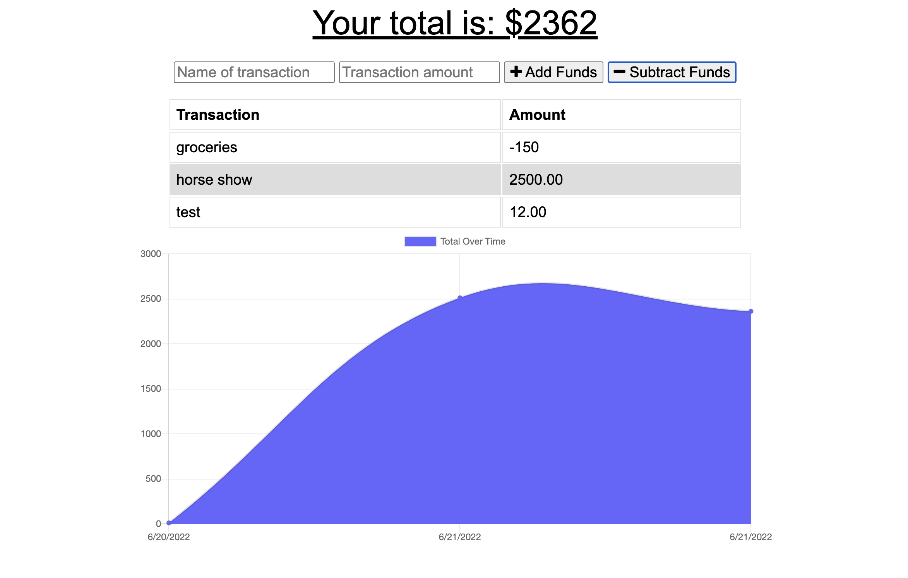

# Budget Tracker

## Table of Contents
- [Description](#description)
- [Installation](#installation)
- [Usage](#usage)
- [License](#license)
- [Contribution](#contribution)

## Description
AS AN avid traveler
I WANT to be able to track my withdrawals and deposits with or without a data/internet connection
SO THAT my account balance is accurate when I am traveling 

## Installation
npm i

## Usage
GIVEN a budget tracker without an internet connection
WHEN the user inputs an expense or deposit
THEN they will receive a notification that they have added an expense or deposit
WHEN the user reestablishes an internet connection
THEN the deposits or expenses added while they were offline are added to their transaction history and their totals are updated

This has online and offline functionality!
## License
MIT

## Contribution
Myself

## Questions?
If you have questions regarding this README, please reach out to me via GitHub or by email.
"https://github.com/Scottietee"
Email: sscotthompson@gmail.com

